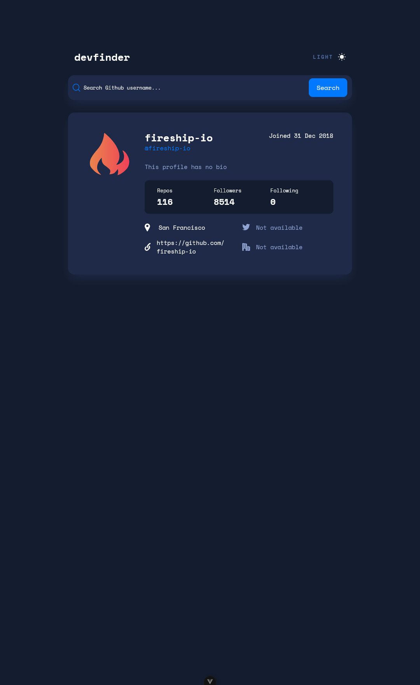

# Frontend Mentor - GitHub user search app solution

This is a solution to the [GitHub user search app challenge on Frontend Mentor](https://www.frontendmentor.io/challenges/github-user-search-app-Q09YOgaH6). Frontend Mentor challenges help you improve your coding skills by building realistic projects.

## Table of contents

- [Overview](#overview)
  - [The challenge](#the-challenge)
  - [Screenshot](#screenshot)
  - [Links](#links)
- [My process](#my-process)
  - [Built with](#built-with)
  - [What I learned](#what-i-learned)
  - [Continued development](#continued-development)
  - [AI Collaboration](#ai-collaboration)
- [Author](#author)

**Note: Delete this note and update the table of contents based on what sections you keep.**

## Overview

### The challenge

Users should be able to:

- View the optimal layout for the app depending on their device's screen size
- See hover states for all interactive elements on the page
- Search for GitHub users by their username
- See relevant user information based on their search
- Switch between light and dark themes
- **Bonus**: Have the correct color scheme chosen for them based on their computer preferences. _Hint_: Research `prefers-color-scheme` in CSS.

### Screenshot

### Links

- Solution URL: [GitHub](https://github.com/GFJankavs/fm-github-user-search)
- Live Site URL: [Website](https://z10kug95g90ki9zqxx21alal.gfjankavs.lv)

## My process

### Built with

- Semantic HTML5 markup
- Flexbox
- CSS Grid
- Mobile-first workflow
- [Vue3](https://vuejs.org/) - JS framework

### What I learned

I learned how to write code in Vue3 using Composition API. As I have mostly developed projects using React, this was a nice freshness for my coding journey.

### Continued development

I would like to focus on writing unit and integration tests for projects. I haven't written them in a while and would like to refresh my memory about them.

### AI Collaboration

I used Claude Code for these specific questions:

- How to dynamically change between ligth/dark mode in VueJS
- Code review after initial code completion

## Author

- Frontend Mentor - [@GFJankavs](https://www.frontendmentor.io/profile/GFJankavs)
- Twitter - [@GFJankavs](https://x.com/GFJankavs)
